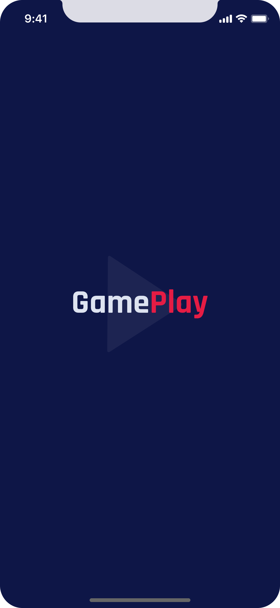
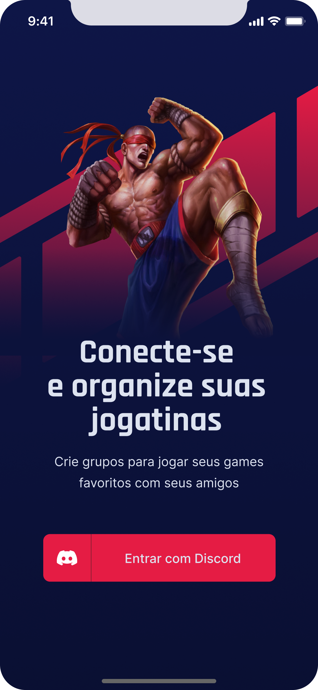
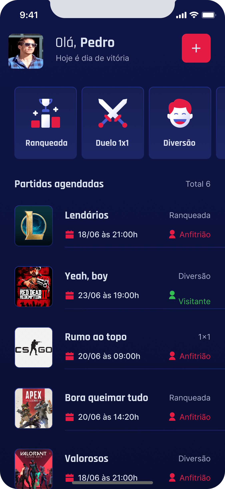
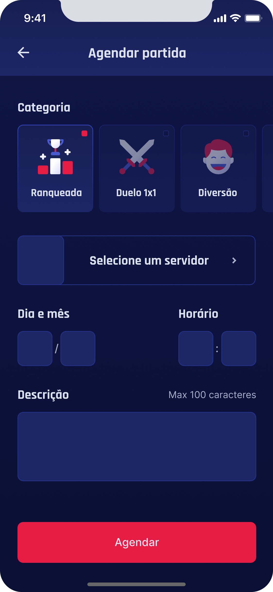
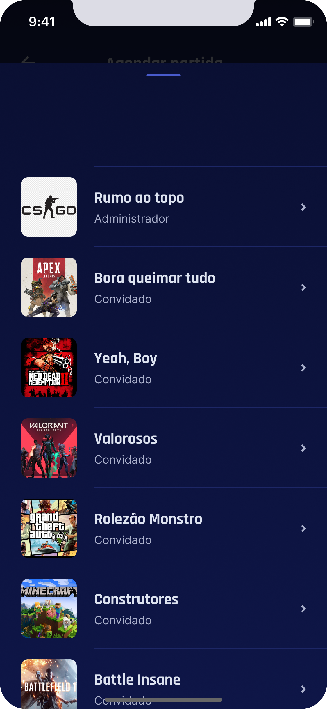
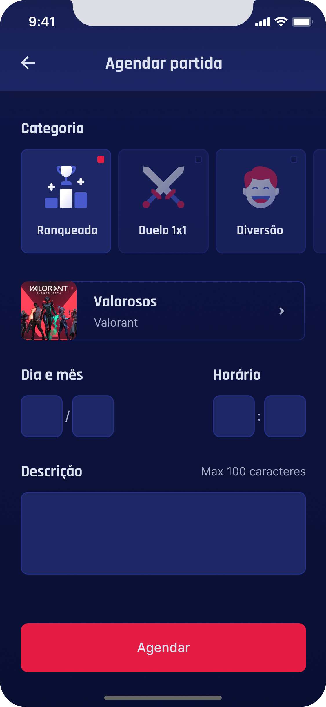
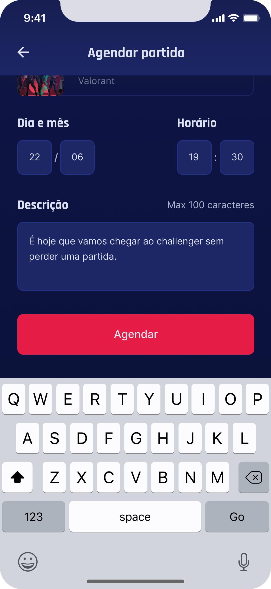
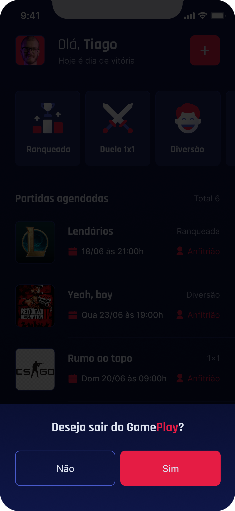
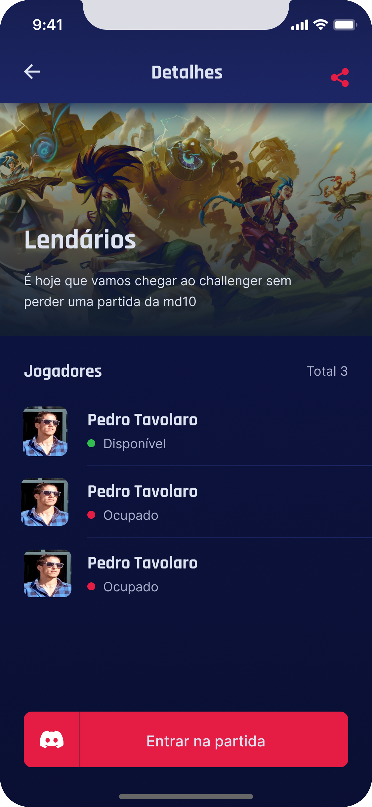

<h1 align="center">GamePlay</h1>

## Descrição do Projeto

<p align="center">A ideia do projeto e Conectar e organize suas jogatinas auxiliando em momentos em que vc quer jogar os games com seus amigos
  e organizar os grupos e os horarios que combinaram no trabalho / faculdade para e assim nos termos um momento de jogar junto
</p>


  <!--ts-->
   * [Features](#features)
   * [Tecnologias](#tecnologias)
   * [Rodando a Aplicação](#como-executar-o-projeto)
   * [Autor](#autor)
<!--te-->

<p align="center"> 
 <a href="https://reactnative.dev/">🔗 React Native</a>
<a href="https://expo.dev/">🔗 Expo</a>
<a href="https://pt-br.reactjs.org/">🔗 React</a>
<a href="https://nodejs.org/en/">🔗 NodeJs</a>
<a href="https://www.npmjs.com/">🔗 NPM</a>
</p>

  
<p align="center">🚀 lib para construir interfaces do usuário com componentes reutilizáveis</p>

<p align="center">

</p>

<p align="center">
   
</p>

<h4 align="center"> 
    🚧  React Native Select 🚀 concluído...  🚧
 </h4>

  ### Features

-   [ ] Autenticação Social OAuth2 com servidor do Discord.
-   [ ] Obtém perfil do usuário cadastro no Discord (username e avatar);
-   [ ] Lista os servidores do Discord que o usuário faz parte;
-   [ ] Permite realizar o agendamento de partidas;
-   [ ] Permite filtrar as partidas por categoria;
-   [ ] Exibe se a partida foi agendada em um servidor próprio (anfitrião) ou em servidores de outros (convidado);
-   [ ] Compartilha o convite para ingressar no servidor do usuário;
-   [ ] Permite redirecionar o usuário para o seu próprio servidor;
-   [ ] Disponibiliza a função de Logout.


<h1 align="left">
  
  
  
</h1>
<h1 align="left">
  
  
  
</h1>
<h1 align="left">
  
  
  
</h1>

## Tecnologias 
As seguintes ferramentas foram usadas na construção do projeto:

-   [ ] React Native
-   [ ] Typescript
-   [ ] Expo
-   [ ] Context API
-   [ ] Async Storage
-   [ ] Vector Icons
-   [ ] React Native Svg e Svg Transform
-   [ ] Axios
-   [ ] Gradient colors
-   [ ] OAuth2 Discord 
-   [ ] Expo Google Fonts
-   [ ] React Navigation Stack
-   [ ] React Native Gesture Handler
-   [ ] Expo Authentication
-   [ ] React Native Share
-   [ ] Deep Link


## Como executar o projeto

## Pré-requisitos
Antes de começar, você vai precisar ter instalado em sua máquina as seguintes ferramentas:
[NodeJs](https://nodejs.org/en/),
[NPM](https://www.npmjs.com/) e
[Expo](https://expo.io/). 
Além disto é bom ter um editor para trabalhar com o código como [VSCode](https://code.visualstudio.com/)

## Rodando a aplicação

### Clone este repositório
$ git clone https://github.com/PedroTavolaro/GamePlay.git

### Acesse a pasta do projeto no seu terminal/cmd
$ cd GamePlay

### Instale as dependências
$ npm install ou yarn install

$ veja o arquivo de dependências https://github.com/PedroTavolaro/GamePlay/blob/main/package.json

Lembre-se de criar o seu App no servidor do Discord para obter as credencias de autenticação. Em seguida, defina no arquivo .env as configurações do seu App (remova o example do arquivo .env.example).
 
 ```cl
REDIRECT_URI=
SCOPE=
RESPONSE_TYPE=
CLIENT_ID=
CDN_IMAGE=
```

## Execute a aplicação
$ expo start

$ Acesse a aplicação apartir do emulador de androind / IOS ou do seu aparelho celular realizando o download do expoClient no PlayStore

## 📝 Licença
Este projeto esta sobe a licença [MIT](./LICENSE).

### Autor
---

<a href="https://pedrotavolaro.com">
 
 <br />
 <sub><b>PedroTavolaro</b></sub></a> <a href="https://www.pedrotavolaro.ccom" title="PedroTavolaro">🚀</a>

Feito com ❤️ por Pedro Tavolaro 👋🏽 Entre em contato!

[](https://twitter.com/pedrotavolaro) [](https://www.linkedin.com/in/pedrotavolaro/) 
[](mailto:phtc-pedro@hotmail.com)
